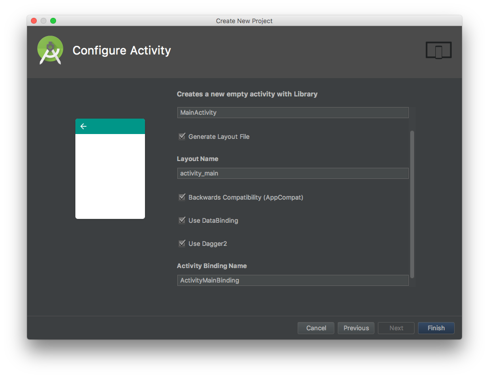
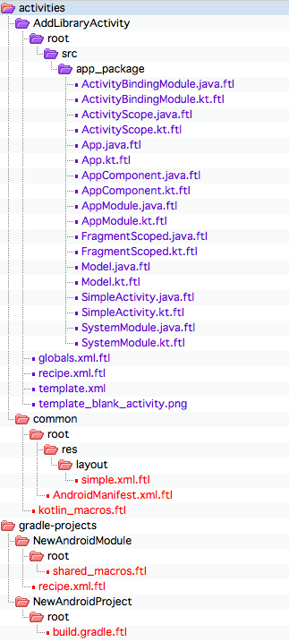

# AddLibraryTemplate
Android Project Template

안드로이드 스튜디오(3.0)에 아래 내용을 선택할 수 있는 프로젝트를 추가하였습니다. 

	- Dagger2 ( Android ) 
	- Data Binding

Kotlin프로젝트에서도 사용할 수 있으며, EmptyActivity를 기준으로 수정되었습니다. 

## Android Studio 캡쳐 화면들

## 수정된 파일

